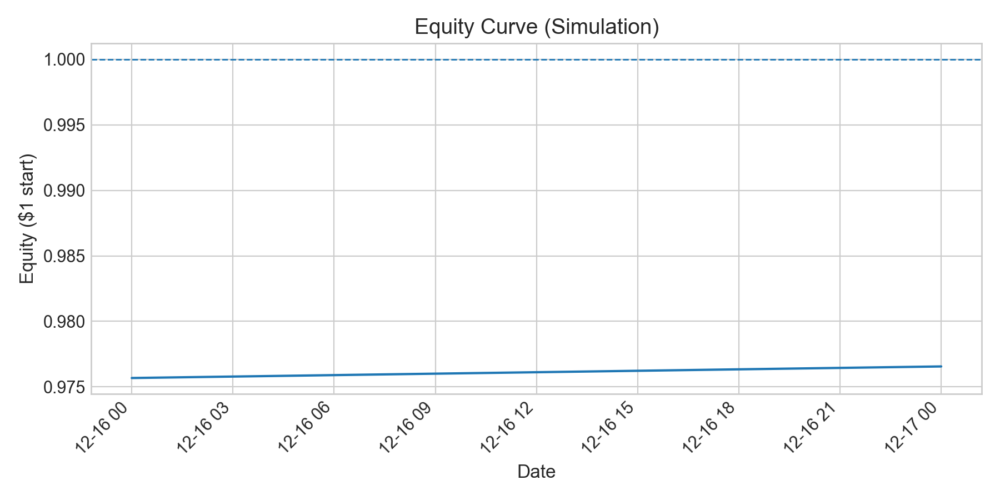
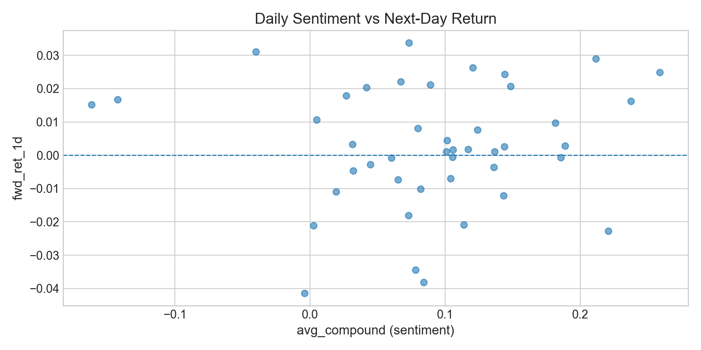

# Market Sentiment Signal

Build a full pipeline that:
1) pulls news articles mentioning a set of public companies,  
2) scores daily sentiment + “news burst” events, and  
3) evaluates whether those signals relate to future returns using an event study and a simple trading simulation.

This project is designed to be reproducible, well-documented, and easy to extend.

---

## Goals

- **Data engineering:** ingest + cache news and price data reliably
- **Signal design:** convert messy text into daily features (sentiment, mention volume, source diversity)
- **Evaluation:** measure signal quality (hit rate, correlation with future returns, t-stats)
- **Simulation:** test a basic rule-based strategy with realistic constraints (delay, slippage, exposure limits)
- **Presentation:** dashboard + report with clear plots and results tables

---

## Data Sources

- **News:** GDELT (Document API)
- **Prices:** Stooq (historical daily prices)

> Note: Raw data is cached locally under `data/` and is not committed to GitHub.

---

## Project Structure

```text
market-sentiment-signal/
  src/
    pipeline.py
    ingestion/
    features/
    backtest/
    viz/
  dashboard/
  report/
  tests/
  data/                (cached locally; gitignored)
  PROGRESS.md
  METRICS.csv
  README.md
  requirements.txt
  .gitignore

```


## Quickstart

### 1) Create + activate environment
```bash
python3 -m venv .venv
source .venv/bin/activate
pip install -U pip
pip install -r requirements.txt
```
### 2) Run the pipeline
```bash
python -m src.pipeline
```
---

## Results 
Equity curve from the current simulator settings:



Relationship between daily sentiment and next-day return:



